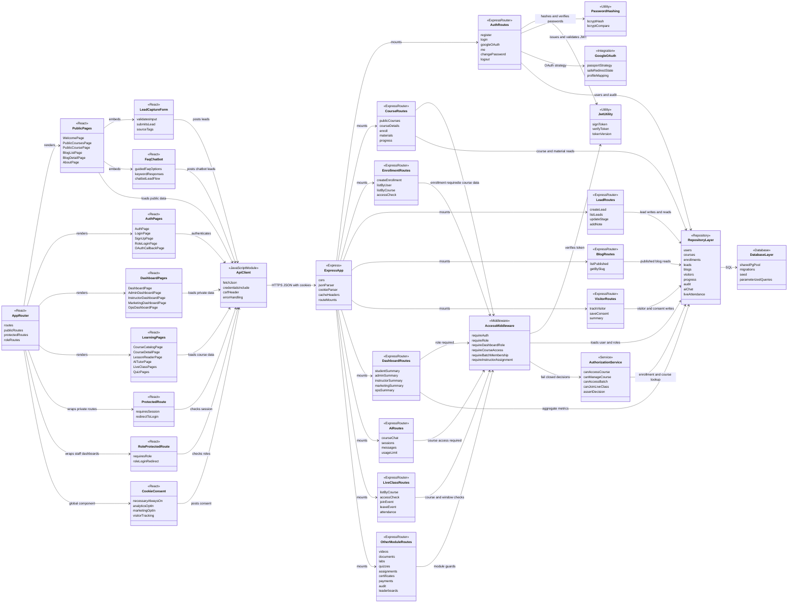

# Cyber Lab IN Class And Component Diagram

This project is JavaScript/React/Express, so this is a practical component and service diagram rather than a pure OOP class model.

Source file: `docs/diagrams/class-component-diagram.mmd`

## Frontend Handoff Notes

- `cyberscout/src/App.jsx` is the active route registry.
- `/` renders `WelcomePage`, which is the production landing page, not an intermediary home screen.
- Public pages use `LeadCaptureForm`, `FaqChatbot`, and `CookieConsent`.
- `ProtectedRoute` gates normal authenticated pages. `RoleProtectedRoute` gates staff dashboards.
- `cyberscout/src/lib/api.js` is the central API client and sends credentials so HTTP-only auth cookies can work across frontend/backend origins.

## Backend Handoff Notes

- `cyberscout-server/src/index.js` creates the Express app, applies CORS, JSON parsing, cookie parsing, cache headers, Passport initialization, and route mounts.
- `cyberscout-server/src/middleware/access.js` centralizes `requireAuth`, `requireRole`, dashboard role groups, course access, batch access, and instructor assignment guards.
- `cyberscout-server/src/services/authorization.js` implements fail-closed decisions for course access, course management, batch access, and live class join checks.
- `cyberscout-server/src/db/repositories.js` owns SQL reads/writes and row mapping.
- Password auth uses bcrypt. JWT sessions use `token_version` so password changes invalidate older sessions.
- Google OAuth is integrated through Passport when Google credentials are configured.

## Current Versus Planned

- Current: Vite React, Express, Supabase PostgreSQL through `pg`, JWT/cookie auth, role dashboards, and database-backed LMS, CRM, analytics, assessment, payment, and audit flows.
- Planned: Supabase Storage for protected assets and expanded production RAG source/chunk persistence. Direct browser table access remains revoked; the Express API is the authorization boundary.
