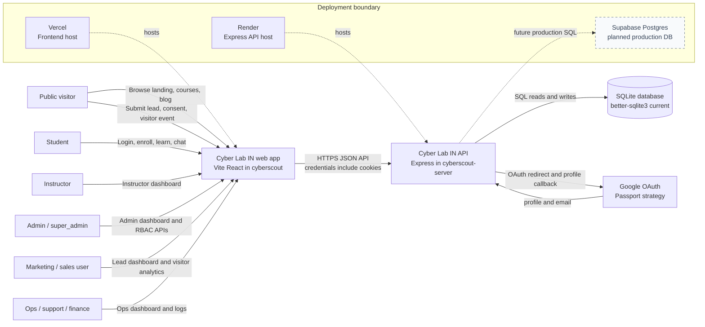

# Cyber Lab IN Data Flow Diagrams

These DFDs describe the current restored legacy architecture:

- Frontend: Vite React app in `cyberscout/`
- Backend: Express API in `cyberscout-server/`
- Current DB: SQLite through `better-sqlite3`
- Planned production DB: Supabase Postgres
- Planned deployment: Vercel frontend, Render backend, Supabase database

## Context-Level DFD

Source file: `docs/diagrams/context-dfd.mmd`

## Level 1 DFD

Source file: `docs/diagrams/level-1-dfd.mmd`

```mermaid
flowchart TB
  PublicVisitor["Public visitor"]
  Student["Student"]
  Staff["Admin / instructor / marketing / ops"]
  GoogleOAuth["Google OAuth"]

  subgraph Frontend["Vite React frontend"]
    Landing["Landing page\n/"]
    PublicCourses["Public course pages\n/courses/..."]
    BlogPages["Blog pages\n/blog/..."]
    AuthPages["Auth pages\n/auth, /login, /signup"]
    LMSPages["Student LMS pages\n/dashboard, /learn/courses"]
    StaffPages["Staff dashboards\n/admin, /marketing, /instructor, /ops"]
    LeadForm["LeadCaptureForm"]
    Chatbot["FaqChatbot"]
    ConsentUI["CookieConsent"]
    ApiClient["API client\nfetch with credentials"]
  end

  subgraph Backend["Express API"]
    AuthRoutes["auth routes"]
    CourseRoutes["course routes"]
    EnrollmentRoutes["enrollment routes"]
    LeadRoutes["lead routes"]
    BlogRoutes["blog routes"]
    VisitorRoutes["visitor routes"]
    DashboardRoutes["dashboard routes"]
    AiRoutes["AI/RAG routes"]
    LiveRoutes["live class routes"]
    PasswordChange["password change"]
    Middleware["requireAuth, requireRole,\nrequireCourseAccess"]
    Repo["repository layer"]
  end

  subgraph DB["SQLite now, Supabase Postgres planned"]
    Users[("users")]
    Courses[("courses, modules,\nlessons, materials")]
    Enrollments[("enrollments")]
    Progress[("user_progress")]
    Leads[("leads, notes,\nfollow_ups")]
    Visitors[("visitor_analytics,\ncookie_consents")]
    Blogs[("blogs")]
    Audit[("audit_logs,\ndocument_access_logs")]
    AiStore[("ai_chat_sessions,\nai_chat_messages")]
    LiveStore[("live_classes,\nlive_class_attendance")]
  end

  PublicVisitor --> Landing
  PublicVisitor --> PublicCourses
  PublicVisitor --> BlogPages
  PublicVisitor --> LeadForm
  PublicVisitor --> Chatbot
  PublicVisitor --> ConsentUI
  Student --> AuthPages
  Student --> LMSPages
  Staff --> StaffPages

  Landing --> ApiClient
  PublicCourses --> ApiClient
  BlogPages --> ApiClient
  AuthPages --> ApiClient
  LMSPages --> ApiClient
  StaffPages --> ApiClient
  LeadForm --> ApiClient
  Chatbot --> ApiClient
  ConsentUI --> ApiClient

  ApiClient -->|"POST /api/leads"| LeadRoutes
  ApiClient -->|"POST /api/visitors/track\nPOST /api/visitors/consent"| VisitorRoutes
  ApiClient -->|"GET /api/courses/public"| CourseRoutes
  ApiClient -->|"GET /api/blogs"| BlogRoutes
  ApiClient -->|"POST /api/auth/login\nPOST /api/auth/register\nGET /api/auth/me"| AuthRoutes
  ApiClient -->|"POST /api/auth/change-password"| PasswordChange
  ApiClient -->|"POST /api/courses/:id/enroll"| EnrollmentRoutes
  ApiClient -->|"GET /api/courses/:id/materials"| CourseRoutes
  ApiClient -->|"GET /api/dashboards/:role"| DashboardRoutes
  ApiClient -->|"POST /api/ai/courses/:id/chat"| AiRoutes
  ApiClient -->|"GET /api/live-classes/..."| LiveRoutes

  AuthRoutes -->|"optional redirect"| GoogleOAuth
  GoogleOAuth -->|"profile callback"| AuthRoutes

  AuthRoutes --> Middleware
  CourseRoutes --> Middleware
  EnrollmentRoutes --> Middleware
  LeadRoutes --> Middleware
  DashboardRoutes --> Middleware
  AiRoutes --> Middleware
  LiveRoutes --> Middleware
  PasswordChange --> Middleware

  Middleware --> Repo
  BlogRoutes --> Repo
  VisitorRoutes --> Repo

  Repo --> Users
  Repo --> Courses
  Repo --> Enrollments
  Repo --> Progress
  Repo --> Leads
  Repo --> Visitors
  Repo --> Blogs
  Repo --> Audit
  Repo --> AiStore
  Repo --> LiveStore

  CourseRoutes -->|"public cache headers"| PublicCourses
  BlogRoutes -->|"public cache headers"| BlogPages
  DashboardRoutes -->|"no-store private data"| StaffPages
```

## Flow Notes

- Public browsing starts in the Vite app and reads published courses/blogs through cached API routes.
- Visitor analytics and cookie consent are posted by frontend components and persisted through `visitor_analytics` and `cookie_consents`.
- Lead submissions come from normal public lead forms and the guided FAQ chatbot. Both write to `leads`; chatbot leads are source tagged.
- Authentication uses email/password and optional Google OAuth. The backend returns a JWT and also sets the `cli_session` HTTP-only cookie.
- Private LMS and dashboard data use `requireAuth`, role guards, and course access checks before repository reads.
- Student course material access is course scoped. Staff dashboards are role scoped.
- Password changes update `password_hash`, increment `token_version`, and force older JWTs to fail.
- Public course and blog routes set short public cache headers. Private API responses are marked `no-store`.

## Planned/Future Flow Markers

- Supabase Postgres is drawn as planned, not active.
- Supabase Storage, Realtime, and RLS are not yet active in the current runtime.
- Some advanced modules are mounted as routes, but several are still MVP/starter implementations compared with the target PRD.
