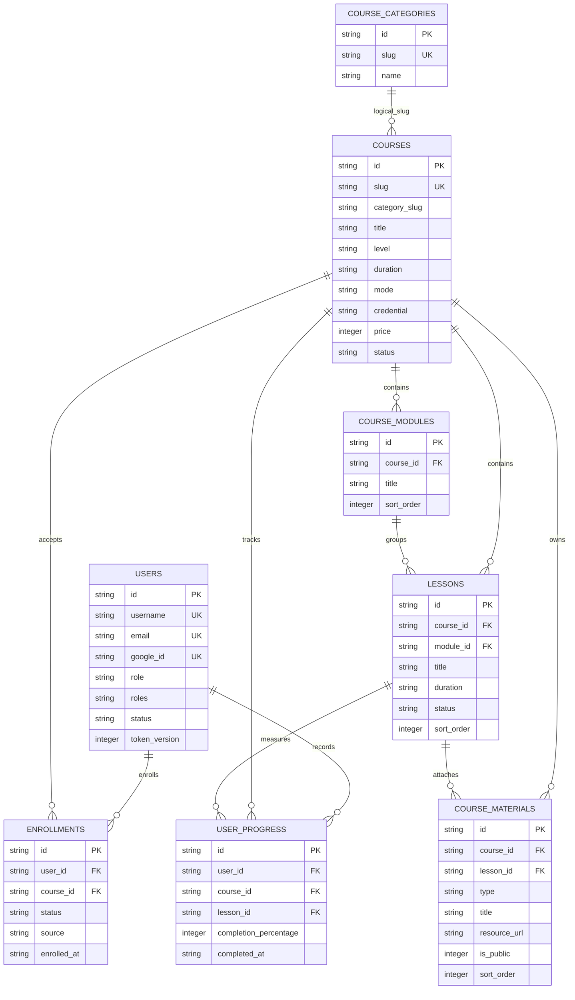
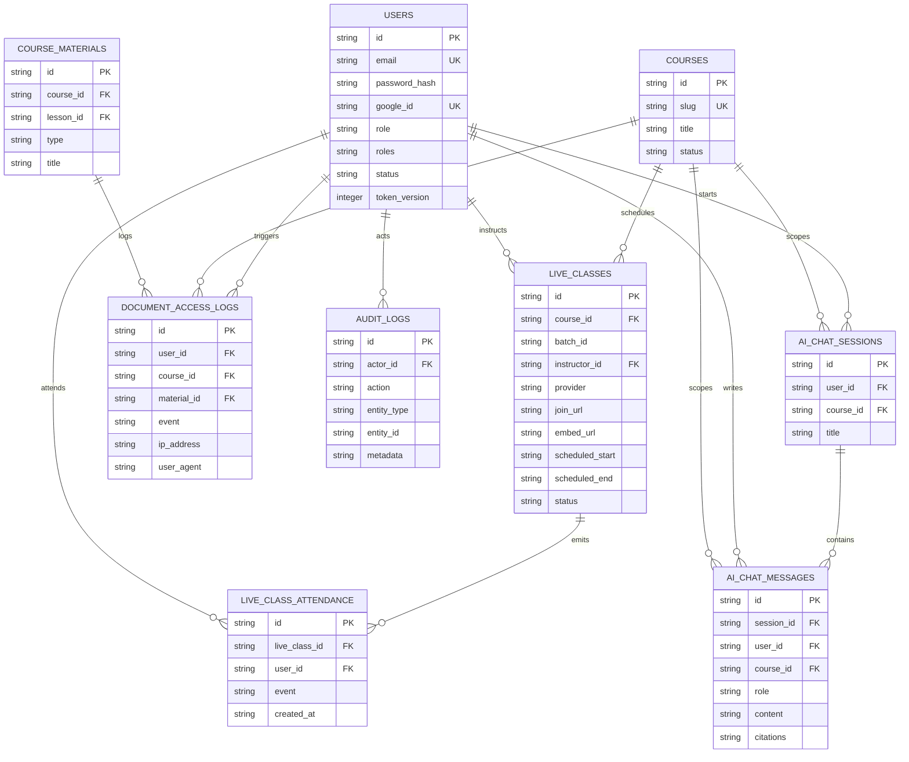
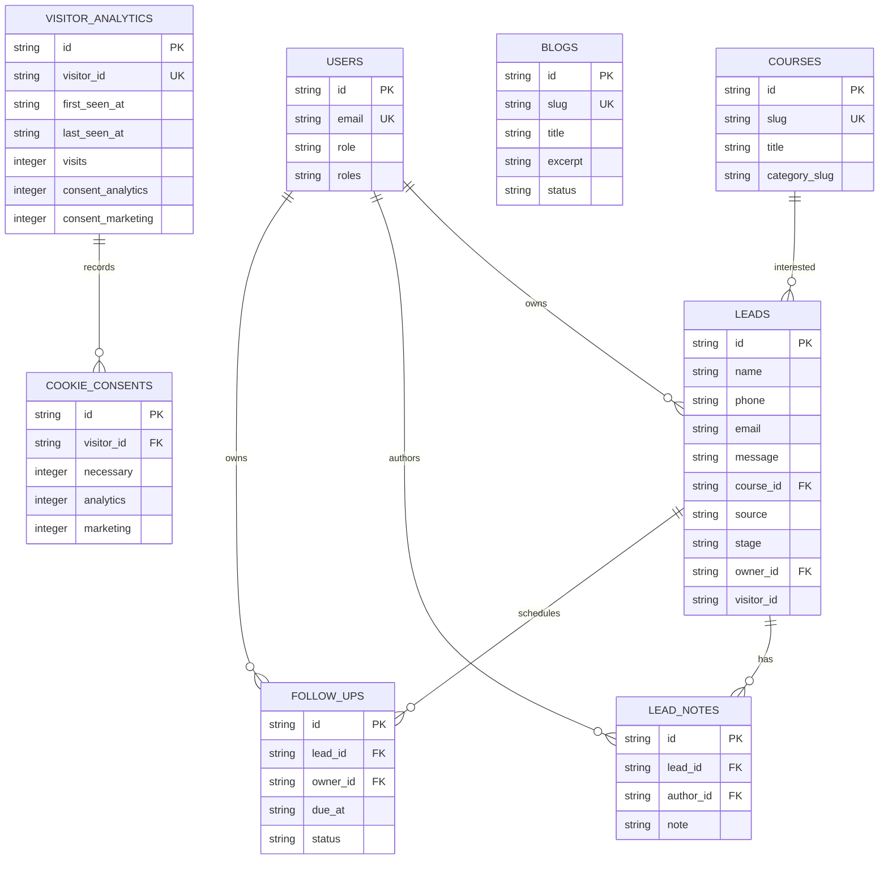
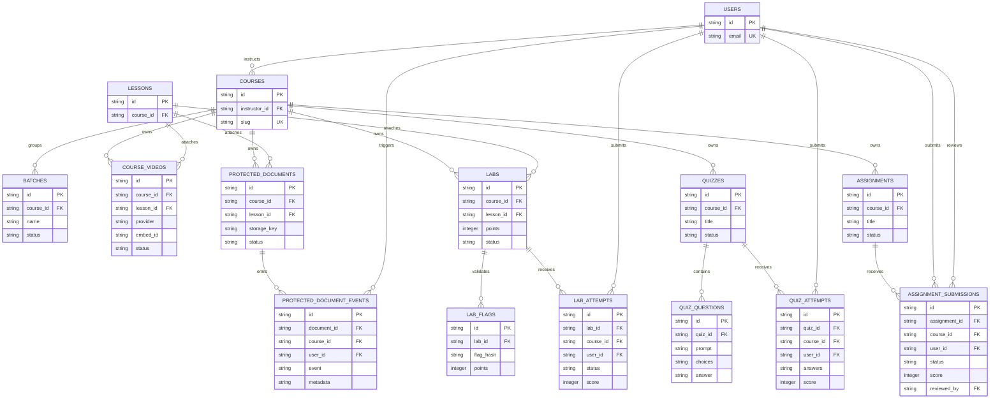
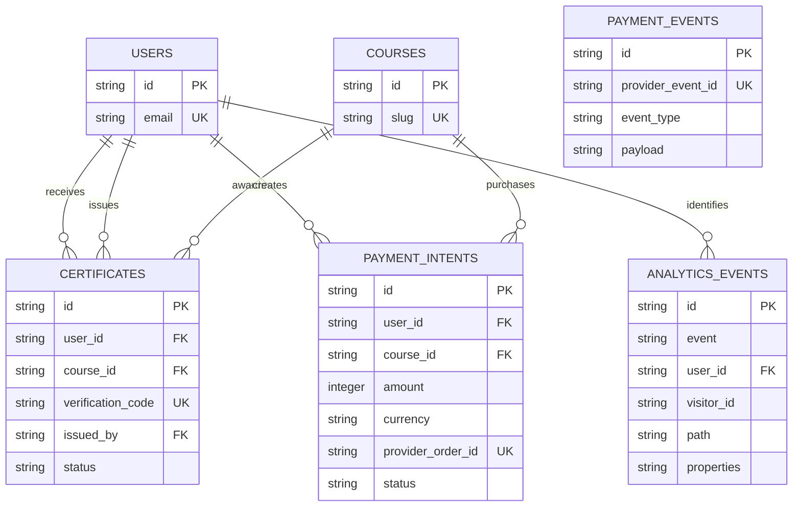

# Cyber Lab IN ER Diagram

This ERD is based on the actual PostgreSQL migration files in `cyberscout-server/db/migrations`:

- `001_core_lms.sql`
- `002_ai_chat_history.sql`
- `003_crm_leads.sql`
- `004_live_class_attendance.sql`
- `005_saas_growth_features.sql`
- `006_blog_metadata.sql`
- `007_funnel_analytics.sql`
- `008_persistent_learning_modules.sql`
- `009_postgresql_constraints.sql`

The complete single-file ERD source is available at `docs/diagrams/er-diagram.mmd`. The sections below split it into readable developer views.

## Core LMS ERD

## Auth, Audit, AI, Live, And Document ERD

## Marketing, Content, And Analytics ERD

## Persisted Learning And Assessment ERD

## Certificates, Payments, And Funnel Events ERD

## Constraints And Delete Behavior

- `users.email`, `users.username`, `users.google_id`, `courses.slug`, `course_categories.slug`, `blogs.slug`, and `visitor_analytics.visitor_id` are unique.
- `schema_migrations.name` is unique and tracks applied migration names.
- `enrollments` has `UNIQUE(user_id, course_id)` to prevent duplicate course enrollment rows.
- `user_progress` has `UNIQUE(user_id, course_id, lesson_id)` for one progress row per lesson scope.
- `certificates.verification_code`, `payment_intents.provider_order_id`, and `payment_events.provider_event_id` are unique.
- Batch, video, protected document, lab, quiz, assignment, certificate, and payment records are persisted by migration `008_persistent_learning_modules.sql`.
- Course deletion cascades to modules, lessons, materials, enrollments, progress, live classes, document access logs, and AI sessions/messages.
- Lesson deletion sets `course_materials.lesson_id` and `user_progress.lesson_id` to `NULL`.
- User deletion cascades to enrollments, progress, document logs, AI chat data, and live attendance; it sets nullable owner/actor/instructor references to `NULL`.
- Lead deletion cascades to lead notes and follow-ups.
- Visitor deletion cascades to cookie consent rows through `visitor_id`.

## Current Implementation Notes

- The running app uses Supabase PostgreSQL through one shared `pg` pool in `cyberscout-server/src/db/index.js`.
- The repository layer in `cyberscout-server/src/db/repositories.js` maps snake_case database rows to frontend-friendly camelCase objects.
- Roles are stored as both `role` and JSONB `roles`; route guards read the parsed `roles` array.
- Course category assignment is currently a logical slug relation from `courses.category_slug` to `course_categories.slug`; the migrations do not enforce it with a foreign key.
- `live_classes.batch_id` and `enrollments.batch_id` are checked against the persisted `batches` table for batch-scoped access.
- `cookie_consents.visitor_id` references `visitor_analytics(visitor_id)`, which is unique.

## Production Notes

- Supabase PostgreSQL is the only production database. Render does not mount or write a local application database.
- `schema_migrations` and an advisory lock make migration execution tracked and safe across concurrent starts.
- The Express API remains the authorization boundary. `supabase/rls-policies.sql` enables RLS and revokes direct table grants from browser roles.
- Supabase Storage metadata and expanded RAG source/chunk persistence remain future work. Learning modules, assessments, certificates, payments, and batch records are already persisted in PostgreSQL.
